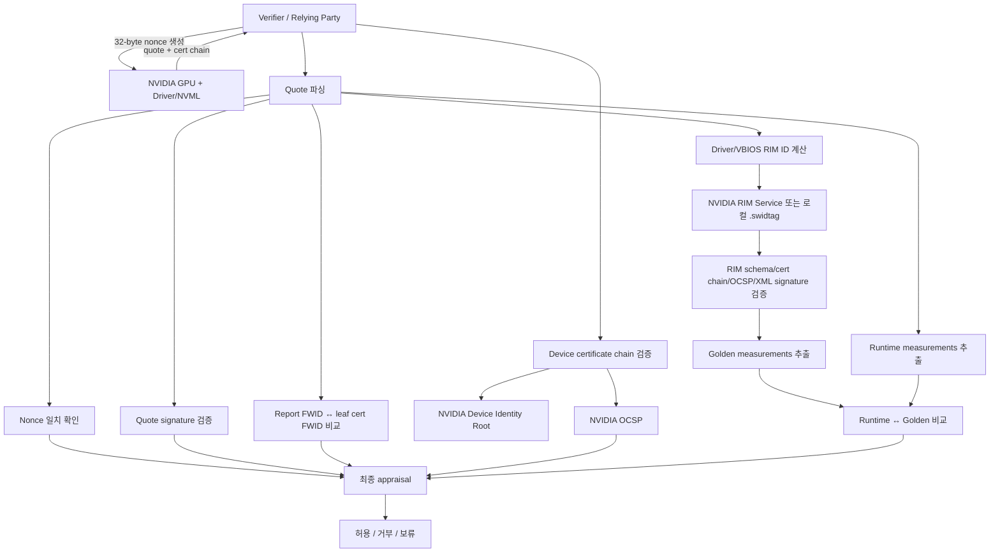
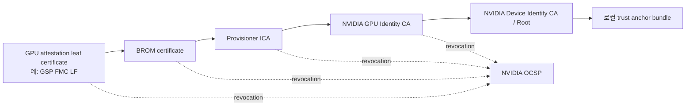
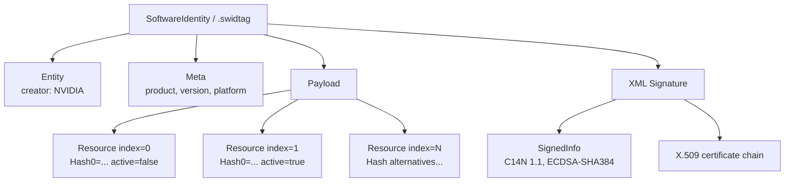
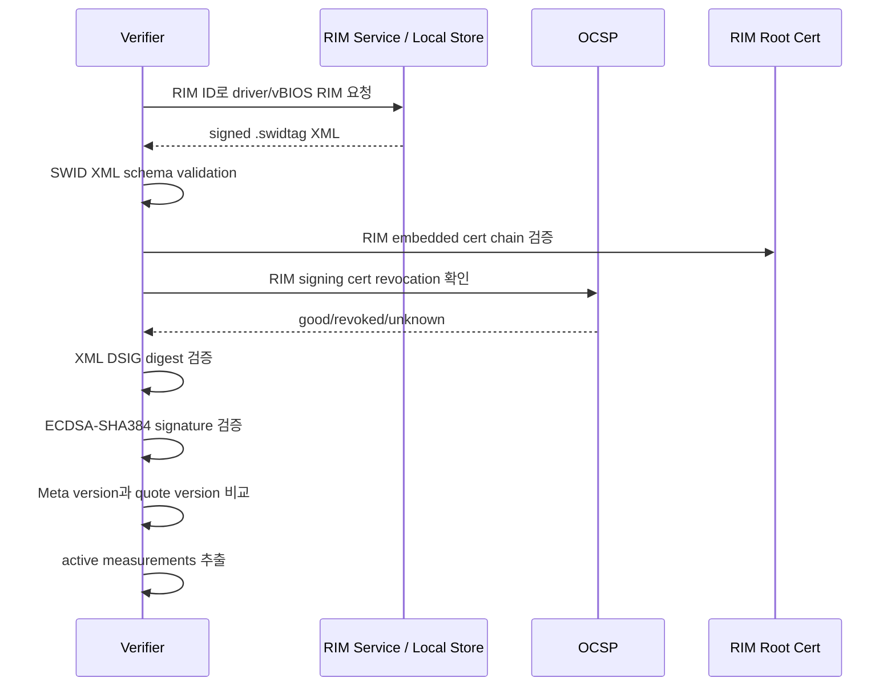
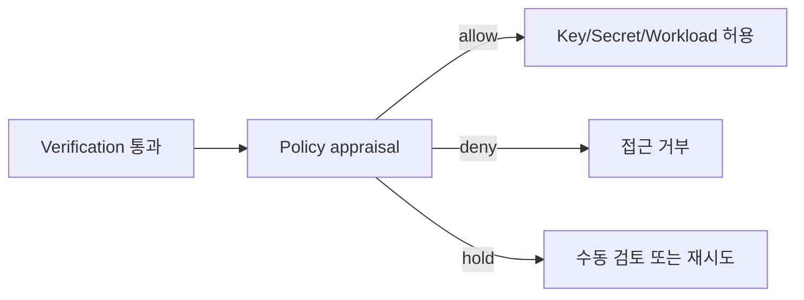

# NVIDIA GPU Attestation Verification 정리

이 문서는 이 저장소의 `nvgpu-attest` 구현을 기준으로 NVIDIA GPU attestation evidence를 **어떻게 검증하고(appraise)**, 그 결과를 신뢰하려면 무엇을 확인해야 하는지 설명합니다. 대상은 Hopper/Blackwell 계열 NVIDIA Confidential Computing GPU의 로컬 검증 흐름입니다.

> 용어 주의: NVIDIA 문서와 SDK는 GPU가 생성한 evidence를 `attestation report`, `quote`, `evidence`라는 이름으로 함께 부릅니다. 이 문서에서는 원본 바이너리 보고서를 `quote`, quote와 certificate chain을 묶은 입력을 `evidence`라고 부릅니다.

## 한눈에 보는 검증 목표

GPU attestation verification은 단순히 “서명 하나가 맞다”를 확인하는 작업이 아닙니다. 아래 질문에 모두 답해야 합니다.

| 질문 | 검증 항목 | 실패하면 의미하는 것 |
| --- | --- | --- |
| 내가 방금 요청한 quote인가? | nonce 일치 | 재사용된 과거 quote 또는 다른 요청의 quote일 수 있음 |
| 진짜 NVIDIA GPU가 만든 quote인가? | device certificate chain + quote signature | 위조 evidence 또는 신뢰할 수 없는 장치일 수 있음 |
| quote를 서명한 키와 보고서 안 GPU 식별자가 같은가? | FWID match | cert와 report가 서로 다른 장치/펌웨어 맥락에서 온 것일 수 있음 |
| 인증서가 현재도 유효한가? | OCSP revocation check | 폐기/정지된 인증서를 계속 신뢰할 수 있음 |
| quote 안 runtime measurement가 NVIDIA가 기대하는 값인가? | RIM fetch/verify + measurement comparison | GPU 펌웨어/VBIOS/driver-loaded firmware 상태가 기대값과 다를 수 있음 |
| 우리 서비스 정책에 맞는가? | appraisal policy | GPU는 정상이어도 허용하지 않는 driver/VBIOS/architecture일 수 있음 |

## 전체 흐름



NVIDIA의 최신 Attestation Suite 문서는 이 흐름을 “evidence 생성 → RIM service에서 golden measurement 가져오기 → NRAS 또는 local verifier가 evidence를 golden measurement와 비교”하는 구조로 설명합니다. 또한 RIM Service, NVIDIA Remote Attestation Service(NRAS), OCSP Service를 핵심 구성요소로 둡니다. 관련 출처는 문서 하단의 [참고 자료](#참고-자료)에 정리했습니다.

## 입력 evidence 형식

이 저장소는 두 가지 입력 방식을 지원합니다.

### 1. Split files

```text
testdata/hopperAttestationReport.txt  # quote 본문, hex text 또는 raw bytes
testdata/hopperCertChain.txt          # quote와 함께 제공된 PEM certificate chain
```

실행 예:

```bash
go run ./cmd/nvgpu-attest \
  --quote testdata/hopperAttestationReport.txt \
  --cert-chain testdata/hopperCertChain.txt \
  --roots testdata/device-root-bundle.pem \
  --nonce 931d8dd0add203ac3d8b4fbde75e115278eefcdceac5b87671a748f32364dfcb
```

### 2. Serialized JSON evidence

NVIDIA SDK/CLI 계열은 보통 아래처럼 device별 evidence 배열을 반환합니다.

```json
[
  {
    "arch": "HOPPER",
    "nonce": "<32-byte hex nonce>",
    "evidence": "<base64 quote>",
    "certificate": "<base64 PEM certificate chain>"
  }
]
```

실행 예:

```bash
go run ./cmd/nvgpu-attest \
  --evidence-json ./testdata/hopper_evidence.json \
  --evidence-index 0
```

멀티 GPU 파일은 `--all-evidence`로 전체 엔트리를 검증합니다.

## Quote 형식: 이 저장소 파서 기준

> NVIDIA 공개 문서가 모든 bit/byte offset을 완전한 규격으로 공개한다고 가정하면 안 됩니다. 아래 표는 `internal/attest/quote.go`의 `ParseQuote` 구현과 Hopper 샘플 evidence를 기준으로 정리한 **구현 기준 구조**입니다.

전체 quote는 다음처럼 나뉩니다.

```text
quote = request(37 bytes) || response(variable length)
response = response_header(8 bytes)
         || measurement_record(measurement_record_length bytes)
         || response_nonce(32 bytes)
         || opaque_length(2 bytes little-endian)
         || opaque_fields(opaque_length bytes)
         || signature(96 bytes)
```

### Request section: 37 bytes

| Offset | Size | Field | 설명 |
| ---: | ---: | --- | --- |
| 0 | 1 | version | request version |
| 1 | 1 | code | SPDM/measurement request code 계열 값 |
| 2 | 1 | param1 | request parameter |
| 3 | 1 | param2 | request parameter |
| 4 | 32 | nonce | verifier가 생성한 challenge nonce |
| 36 | 1 | slot_id | certificate slot |

검증자는 `request.nonce`가 자신이 생성한 32-byte nonce와 같은지 반드시 확인합니다. 이 저장소의 기본 샘플 nonce는 다음 값입니다.

```text
931d8dd0add203ac3d8b4fbde75e115278eefcdceac5b87671a748f32364dfcb
```

### Response header: 8 bytes

| Offset in response | Size | Field | 설명 |
| ---: | ---: | --- | --- |
| 0 | 1 | version | response version |
| 1 | 1 | code | response code |
| 2 | 1 | param1 | response parameter |
| 3 | 1 | param2 | response parameter |
| 4 | 1 | measurement_block_count | measurement block 개수. Hopper 샘플은 64개 |
| 5 | 3 | measurement_record_length | little-endian 24-bit 길이 |

### Measurement record

`measurement_record`에는 GPU가 측정한 runtime measurement들이 들어 있습니다. 이 저장소의 `Response.GetMeasurements()`는 각 block을 다음처럼 읽습니다.

```text
measurement_block = index(1) || spec(1) || block_size(2 LE) || block_payload
block_payload     = type_or_spec(1) || value_size(2 LE) || measurement_value(value_size)
```

- `index`는 1-based로 들어오며, 비교할 때는 배열 index로 맞추기 위해 `index - 1` 위치에 저장합니다.
- measurement value는 hex string으로 변환해 RIM의 `Hash*` 값과 비교합니다.
- 샘플 Hopper quote는 `measurement_block_count = 64`, `measurement_record_length = 3520`입니다.

### Opaque fields

`opaque_fields`는 다음 형태의 TLV(type-length-value) 목록입니다.

```text
opaque_field = field_type(2 bytes LE) || size(2 bytes LE) || value(size bytes)
```

이 저장소가 현재 해석하는 주요 field는 다음과 같습니다.

| Field type | 이름 | 사용 목적 |
| ---: | --- | --- |
| 3 | driver version | driver RIM ID 계산 및 RIM version match |
| 6 | VBIOS version | VBIOS RIM ID 계산 및 RIM version match |
| 11 | NVDEC0 status | disabled이면 measurement 35 skip |
| 20 | FWID | quote FWID와 leaf certificate FWID 일치 확인 |
| 34 | opaque data version | opaque data 해석 버전 |
| 35 | chip info | chip/platform 표시용 정보 |
| 36 | feature flag | SPT/MPT/PPCIE 등 feature 표시 |

VBIOS RIM ID 계산에는 추가 opaque field(`project`, `project SKU`, `chip SKU`)도 사용됩니다. 현재 구현은 내부 field 17, 18, 15를 조합합니다.

## Quote 서명 검증 방법

Quote signature 검증은 “quote가 NVIDIA device certificate의 leaf public key에 대응하는 private key로 서명되었는가?”를 확인하는 단계입니다.

이 저장소의 Hopper/Blackwell 샘플 기준:

| 항목 | 값 |
| --- | --- |
| 서명 알고리즘 | ECDSA P-384 |
| 해시 | SHA-384 |
| signature encoding | raw `r || s` |
| signature 길이 | 96 bytes (`r` 48 bytes + `s` 48 bytes) |
| signed data | quote 전체에서 마지막 96-byte signature를 제외한 부분 |
| public key | certificate chain의 leaf certificate public key |

검증 의사코드:

```text
signed_data = quote[0 : len(quote)-96]
signature   = quote[len(quote)-96 :]
digest      = SHA384(signed_data)
r           = signature[0:48]
s           = signature[48:96]
valid       = ECDSA_VERIFY(leaf_cert.public_key, digest, r, s)
```

서명만 맞아도 충분하지 않습니다. leaf certificate 자체가 NVIDIA Device Identity trust root까지 검증되어야 하고, certificate revocation 상태도 확인해야 합니다.

## Certificate chain 검증



검증자는 다음을 확인합니다.

1. certificate chain이 X.509 규칙에 따라 NVIDIA device root bundle까지 이어지는지 확인합니다.
2. leaf public key로 quote signature를 검증합니다.
3. quote opaque field의 FWID와 leaf certificate extension의 FWID를 비교합니다.
4. OCSP로 chain 내 certificate의 현재 revocation 상태를 확인합니다.

이 저장소의 샘플 chain 검증 결과는 다음처럼 이어집니다.

```text
GH100 A01 GSP FMC LF
→ GH100 A01 GSP BROM
→ NVIDIA GH100 Provisioner ICA 1
→ NVIDIA GH100 Identity
→ NVIDIA Device Identity CA
```

## FWID match가 중요한 이유

FWID(Firmware ID)는 quote 안의 firmware identity와 certificate에 들어 있는 firmware identity가 같은지 연결하는 값입니다.

- quote의 FWID만 믿으면, 그 값을 누가 서명했는지 알 수 없습니다.
- certificate의 FWID만 믿으면, 실제 report 내용이 그 FWID를 가진 GPU 상태인지 알 수 없습니다.
- 따라서 **quote signature가 leaf cert로 검증되고**, 동시에 **quote FWID와 leaf cert FWID가 일치**해야 합니다.

이 저장소는 leaf certificate extension에서 마지막 48 bytes를 FWID로 추출하고, quote opaque field 20의 값과 case-insensitive hex 비교를 수행합니다.

## OCSP란 무엇인가?

OCSP(Online Certificate Status Protocol)는 “이 인증서가 지금도 유효한가?”를 확인하는 온라인 프로토콜입니다. CRL처럼 긴 폐기 목록을 내려받는 대신, verifier가 특정 certificate와 issuer 정보를 보내면 OCSP responder가 해당 certificate status를 응답합니다.

NVIDIA NDIS OCSP 문서는 NVIDIA device identity certificate 상태를 실시간으로 검증하기 위한 endpoint를 제공합니다.

```text
https://ocsp.ndis.nvidia.com
```

OCSP 응답에서 중요한 값:

| 값 | 의미 | verifier 판단 |
| --- | --- | --- |
| `good` | 폐기되지 않은 인증서 | 통과 후보 |
| `revoked` | 폐기된 인증서 | 실패 처리 |
| `unknown` | responder가 상태를 판단할 수 없음 | 실패 또는 보류 처리 |
| `thisUpdate` / `nextUpdate` | 응답 유효 기간 | 너무 오래된 응답이면 신뢰하지 않음 |
| nonce match | 요청 nonce와 응답 nonce 일치 | replay 방지에 도움 |
| response signature valid | OCSP 응답 자체의 서명 검증 | 위조 응답 방지 |

이 저장소의 현재 구현은 `openssl ocsp`를 호출해 status를 파싱합니다.

```bash
openssl ocsp \
  -issuer issuer.pem \
  -cert target.pem \
  -url https://ocsp.ndis.nvidia.com \
  -noverify \
  -timeout 10
```

> 운영 환경에서는 OCSP 응답 signature, responder certificate chain, nonce, validity interval을 엄격하게 검증하는 것이 좋습니다. 이 저장소는 학습/예제 성격이므로 일부 검증은 OpenSSL 출력 파싱에 의존합니다.

## OCSP와 RIM Service는 무엇이 다른가?

둘 다 네트워크를 사용할 수 있어서 혼동하기 쉽지만, 검증자가 묻는 질문이 다릅니다.

| 구분 | OCSP | RIM Service |
| --- | --- | --- |
| 핵심 질문 | “이 인증서를 아직 신뢰해도 되는가?” | “이 driver/VBIOS 조합의 기대 measurement는 무엇인가?” |
| 입력 | 검증 대상 certificate + issuer certificate | RIM ID, 예: `NV_GPU_DRIVER_GH100_550.90.07` |
| 출력 | certificate status: `good`, `revoked`, `unknown` 등 | NVIDIA가 서명한 SWID XML RIM(`.swidtag`) |
| 이 저장소 기본 endpoint | `https://ocsp.ndis.nvidia.com` | `https://rim.attestation.nvidia.com/v1/rim/<RIM_ID>` |
| 검증 대상 | device cert chain, RIM signing cert chain의 revocation 상태 | quote runtime measurement와 비교할 golden measurement 문서 |
| 실패 의미 | 인증서가 폐기/정지되었거나 responder가 상태를 판단할 수 없음 | RIM ID가 잘못되었거나, 해당 version이 없거나, service/API 접근 문제가 있음 |

따라서 `--verify-ocsp`와 `--verify-rim`은 서로 대체 관계가 아닙니다.

- `--verify-ocsp`는 **device certificate chain**의 revocation 상태를 확인합니다.
- `--verify-rim`은 RIM을 가져오거나 로컬 파일을 읽고, 그 RIM의 schema/cert chain/signature를 검증한 뒤 measurement를 비교합니다. 이 과정에서 RIM 안에 포함된 signing certificate chain도 신뢰해야 하므로 **RIM 검증 중에도 OCSP를 호출**합니다.

즉 `--verify-rim` 실행 중 보이는 OCSP 질의는 “RIM Service에 물어보는 것”이 아니라, RIM 문서를 서명한 certificate가 현재 폐기되지 않았는지 확인하는 별도 단계입니다.

## RIM이란 무엇인가?

RIM(Reference Integrity Manifest)은 verifier가 runtime evidence를 평가할 때 사용하는 **정답지(golden measurements)** 입니다.

Trusted Computing Group(TCG)의 RIM Information Model은 RIM을 “verifier가 actual evidence를 expected assertions와 비교할 수 있게 reference measurements를 담는 구조”로 정의합니다. NVIDIA 환경에서는 RIM Service가 driver/VBIOS 등에 대한 signed RIM을 제공합니다.

쉽게 말하면:

- quote의 measurement = GPU가 “현재 내 상태는 이렇다”고 제출한 실제값
- RIM의 measurement = NVIDIA가 “정상/기대 상태라면 이 값이어야 한다”고 서명해 배포한 기준값
- appraisal = 실제값과 기준값을 비교해 허용 여부를 결정하는 과정

### NVIDIA RIM 파일 구조

NVIDIA RIM은 SWID XML(`.swidtag`) 형태이며 대략 다음 요소를 포함합니다.



주요 필드:

| RIM 요소/속성 | 설명 |
| --- | --- |
| `SoftwareIdentity` | RIM 문서 root |
| `Entity` | RIM creator/issuer 정보 |
| `Meta.colloquialVersion` | 실제 driver 또는 firmware version |
| `Meta.product` | GPU product/model |
| `Payload.Resource` | measurement 하나를 나타내는 항목 |
| `Resource.index` | quote measurement index와 비교할 번호 |
| `Resource.active` | 현재 appraisal에 사용할 golden measurement인지 여부 |
| `Resource.Hash*` | 허용되는 SHA-384 measurement 후보 |
| `ds:Signature` | RIM XML document의 무결성과 출처를 검증하는 서명 |
| `ds:X509Certificate` | RIM signature 검증에 사용할 certificate chain |

NVIDIA RIM Guide는 RIM payload가 measurement hash들을 담고, signature는 NVIDIA attestation service가 서명하며, 포함된 X.509 certificate로 검증할 수 있다고 설명합니다.

## RIM 검증 절차

RIM을 가져왔다고 바로 믿으면 안 됩니다. RIM 자체도 아래처럼 검증해야 합니다.



이 저장소의 `--verify-rim`은 다음을 수행합니다.

1. quote에서 driver version, VBIOS version, project/SKU/chip 정보를 읽습니다.
2. RIM ID를 계산합니다.
   - driver 예: `NV_GPU_DRIVER_GH100_550.90.07`
   - VBIOS 예: `NV_GPU_VBIOS_1010_0200_882_96009F0001`
3. `--driver-rim`, `--vbios-rim`이 있으면 로컬 `.swidtag`를 사용합니다.
4. 로컬 경로가 없으면 `https://rim.attestation.nvidia.com/v1/rim/<RIM_ID>`에서 가져옵니다.
5. SWID schema validation을 수행합니다.
6. RIM 내부 X.509 certificate chain을 `verifier_RIM_root.pem`으로 검증합니다.
7. RIM signing certificate chain에 대해 OCSP를 확인합니다.
8. XML DSIG의 digest와 ECDSA-SHA384 signature를 검증합니다.
9. RIM의 `colloquialVersion`이 quote에서 추출한 driver/VBIOS version과 같은지 확인합니다.
10. active measurement만 골라 quote runtime measurement와 비교합니다.

## Measurement appraisal: 값을 평가하려면 무엇을 해야 하나?

값 평가(appraisal)는 “검증 결과를 우리 정책으로 받아들일 수 있는가?”를 결정하는 마지막 단계입니다.

### 1. Cryptographic verification을 모두 통과해야 함

최소 조건:

- request nonce match = `true`
- device certificate chain verified = `true`
- quote signature verified = `true`
- FWID match = `true`
- device/RIM certificate OCSP status = `good` 또는 정책상 허용된 상태
- RIM schema validated = `true`
- RIM certificate chain verified = `true`
- RIM signature verified = `true`
- driver/VBIOS RIM version match = `true`
- runtime measurements match golden measurements = `success`

### 2. Runtime measurement와 golden measurement를 비교해야 함

비교 방식:

```text
runtime[index] == one_of(active_rim_resource[index].Hash*)
```

- driver RIM과 VBIOS RIM의 active measurements를 합칩니다.
- 두 RIM이 같은 index에 active measurement를 동시에 제공하면 conflict입니다.
- RIM에 여러 `Hash*` alternative가 있으면 그중 하나와 일치하면 통과할 수 있습니다.
- 이 저장소는 NVDEC0가 disabled인 경우 measurement 35를 skip합니다.

### 3. 서비스 정책을 추가 적용해야 함

암호학적으로 정상인 GPU라도 서비스 정책에 맞지 않으면 거부할 수 있습니다.

예시 정책:

| 정책 질문 | 예시 판단 |
| --- | --- |
| 허용 architecture인가? | HOPPER/BLACKWELL만 허용 |
| 허용 driver version인가? | `550.90.07` 이상 또는 승인된 allowlist만 허용 |
| 허용 VBIOS version인가? | 승인된 VBIOS allowlist만 허용 |
| secure boot이 켜져 있는가? | `secboot=true` 필요 |
| debug facility가 꺼져 있는가? | `dbgstat=disabled` 필요 |
| certificate hold를 허용할 것인가? | 기본 거부, 긴급 운영 정책에서만 제한적으로 허용 |
| evidence age는 적절한가? | nonce/iat/nbf/exp 기반 freshness 확인 |

### 4. 결과를 리소스 접근 제어와 연결해야 함

최종적으로 attestation result는 secret release, workload scheduling, model key unwrap, API access 등과 연결됩니다.



## 이 저장소에서 전체 검증 실행하기

### 기본 quote 검증

```bash
go run ./cmd/nvgpu-attest verify --json
```

샘플 출력의 핵심 필드:

```json
{
  "cert_chain_verified": true,
  "quote_signature_verified": true,
  "nonce_matches": true,
  "fwid_matches": true,
  "measurement_block_count": 64,
  "driver_version": "550.90.07",
  "vbios_version": "96.00.9f.00.01"
}
```

### OCSP + RIM + measurement까지 검증

> 현재 저장소의 샘플 driver RIM certificate는 2026-06-01T02:08:29Z 이후 현재 시간 기준으로 만료 상태가 될 수 있습니다. 재현 목적이면 `--time 2026-05-25T00:00:00Z`처럼 certificate validity 기준 시간을 지정할 수 있습니다. 운영 검증에는 최신 RIM과 root/certificate bundle을 사용하세요. 기본 quote/cert/signature 검증(`go run ./cmd/nvgpu-attest verify --json`)은 이 만료 이슈와 별개입니다.

검증 층을 분리해서 보면 다음과 같습니다.

1. 기본 검증: nonce, device cert chain, quote signature, FWID match를 확인합니다.
2. `--verify-ocsp`: device cert chain의 revocation 상태를 NVIDIA OCSP로 확인합니다.
3. `--verify-rim`: driver/VBIOS RIM을 로컬 파일 또는 RIM Service에서 확보합니다.
4. RIM 자체 검증: RIM schema, embedded cert chain, RIM signing cert OCSP, XML signature를 확인합니다.
5. Measurement appraisal: quote runtime measurement와 RIM active golden measurement를 비교합니다.
6. Policy appraisal: 필요하면 driver/VBIOS/architecture allowlist와 `--policy-require-*` 조건을 적용합니다.

로컬 RIM 사용:

```bash
go run ./cmd/nvgpu-attest verify \
  --verify-ocsp \
  --verify-rim \
  --driver-rim ./testdata/NV_GPU_DRIVER_GH100_550.90.07.swidtag \
  --vbios-rim ./testdata/NV_GPU_VBIOS_1010_0200_882_96009F0001.swidtag \
  --time 2026-05-25T00:00:00Z \
  --json
```

RIM Service fetch 사용:

```bash
go run ./cmd/nvgpu-attest verify \
  --verify-ocsp \
  --verify-rim \
  --time 2026-05-25T00:00:00Z \
  --json
```

샘플 evidence 재현에서는 로컬 RIM을 쓰든 RIM Service에서 fetch하든 같은 certificate validity 기준이 적용됩니다. 예를 들어 이 저장소의 Hopper 샘플이 요구하는 driver RIM ID `NV_GPU_DRIVER_GH100_550.90.07`의 signing certificate가 현재 시간 기준으로 만료되어 있으면, RIM fetch 자체가 성공해도 RIM cert chain 검증에서 실패하는 것이 정상입니다. 이 경우 실패 원인은 RIM Service와 OCSP가 같은 서비스인지 여부가 아니라, **가져온 RIM을 서명한 certificate의 NotAfter가 검증 기준 시간보다 과거**이기 때문입니다.

운영 검증에서는 과거 `--time`으로 우회하지 말고, fresh evidence와 현재 driver/VBIOS에 맞는 최신 RIM 및 trust bundle을 사용해야 합니다. `--time`은 샘플 재현이나 회귀 테스트처럼 과거 기준의 validity를 확인해야 할 때만 사용하세요.

## Local verifier와 NRAS의 차이

| 방식 | 장점 | 주의점 |
| --- | --- | --- |
| Local verifier | evidence, cert, RIM, OCSP를 직접 검증하므로 독립적인 제어 가능 | RIM/OCSP availability, cache, XML DSIG, policy를 직접 책임져야 함 |
| NRAS(NVIDIA Remote Attestation Service) | NVIDIA가 remote appraisal을 수행하고 signed token/JWT 형태 결과 제공 | 외부 서비스 의존성, API key/availability/latency 정책 필요 |

운영 환경에서는 두 방식 모두 결과 token/claim을 그대로 믿기보다, relying party policy로 한 번 더 평가하는 것이 안전합니다.

## 흔한 실패 원인과 해석

| 실패 | 가능한 원인 | 점검 |
| --- | --- | --- |
| nonce mismatch | 다른 요청의 evidence, replay, 잘못된 `--nonce` | evidence 생성 시 nonce와 verifier 입력 nonce 비교 |
| quote signature failed | quote 변조, leaf cert 불일치, parsing 오류 | cert chain 순서와 signed data 범위 확인 |
| cert chain failed | root bundle 누락/오래됨, chain 순서 오류 | `device-root-bundle.pem` 최신성 확인 |
| OCSP `revoked` | 인증서 폐기 | 즉시 실패 처리 권장 |
| OCSP `unknown` | 잘못된 issuer/cert 쌍, responder 문제 | issuer pair와 endpoint 확인 |
| RIM fetch failed | RIM ID 계산 오류, service/network 문제, 미등록 version | driver/VBIOS version 및 project/SKU/chip 값 확인 |
| RIM cert chain expired/not yet valid | RIM Service나 로컬 파일에서 가져온 RIM의 embedded signing certificate가 검증 기준 시간에 유효하지 않음 | `--time` 기준, RIM signing cert NotBefore/NotAfter, 최신 RIM 여부 확인 |
| RIM OCSP failed | RIM signing certificate chain의 revocation status가 `good`이 아니거나 OCSP 질의 실패 | OCSP endpoint, issuer/cert pair, responder 응답 확인 |
| RIM signature failed | RIM 변조, XML canonicalization 문제 | schema/c14n/embedded cert 확인 |
| measurement mismatch | GPU firmware 상태가 기대값과 다름, 다른 RIM 사용 | RIM version match와 active index conflict 확인 |

## 운영 체크리스트

- [ ] verifier가 직접 32-byte nonce를 생성하고, nonce를 재사용하지 않는다.
- [ ] evidence 수집 직후 짧은 시간 안에 검증한다.
- [ ] NVIDIA device root bundle과 RIM root certificate를 신뢰할 수 있는 경로로 관리한다.
- [ ] OCSP 응답의 status, nonce, signature, validity interval을 검증한다.
- [ ] RIM은 schema, cert chain, OCSP, XML signature를 모두 통과해야 사용한다.
- [ ] driver/VBIOS RIM version과 quote에서 추출한 version이 일치해야 한다.
- [ ] runtime measurement와 active golden measurement가 모두 일치해야 한다.
- [ ] attestation 통과 후에도 architecture, driver/VBIOS allowlist, secure boot, debug status 등 서비스 정책을 적용한다.
- [ ] 실패 결과와 원본 evidence hash를 audit log에 남긴다.
- [ ] RIM/OCSP 캐시를 쓴다면 만료/재검증 정책을 명확히 둔다.

## Mock quote 생성과 동일 검증 경로

이 저장소는 테스트/교육 목적으로 `root`와 `mock` subcommand를 제공합니다. `root`는 테스트 전용 root key/cert를 만들고, `mock`은 그 root key/cert를 인자로 받아 mock evidence를 생성합니다.

| 명령 | 생성 파일 | 설명 |
| --- | --- | --- |
| `root` | `mock-root/root-key.pem` | 테스트 전용 root private key |
| `root` | `mock-root/root.pem` | 테스트 전용 trust anchor |
| `mock` | `mock-evidence/leaf-key.pem` | mock quote 서명용 leaf private key |
| `mock` | `mock-evidence/cert-chain.pem` | leaf → mock root PEM chain |
| `mock` | `mock-evidence/root.pem` | 검증 편의를 위해 복사된 mock root cert |
| `mock` | `mock-evidence/quote.hex` | 모조 NVGPU quote |
| `mock` | `mock-evidence/evidence.json` | NVIDIA SDK 형식과 비슷한 serialized evidence |
| `mock` | `mock-evidence/nonce.txt` | quote request nonce |

중요한 설계 원칙은 **검증 경로를 나누지 않는 것**입니다. mock quote는 별도 mock verifier로 통과시키지 않고, 실제 샘플 quote와 같은 `VerifyFilesWithOptions` 또는 `VerifySerializedEvidence...WithOptions` 경로를 통과해야 합니다. 차이는 `--roots`에 NVIDIA root bundle 대신 `root.pem`을 넣는 것뿐입니다.

```bash
go run ./cmd/nvgpu-attest root --out ./mock-root

go run ./cmd/nvgpu-attest mock \
  --root-key ./mock-root/root-key.pem \
  --root-cert ./mock-root/root.pem \
  --out ./mock-evidence

go run ./cmd/nvgpu-attest verify \
  --quote ./mock-evidence/quote.hex \
  --cert-chain ./mock-evidence/cert-chain.pem \
  --roots ./mock-evidence/root.pem \
  --nonce $(cat ./mock-evidence/nonce.txt) \
  --json
```

serialized evidence도 같은 verifier를 사용합니다.

```bash
go run ./cmd/nvgpu-attest verify \
  --evidence-json ./mock-evidence/evidence.json \
  --roots ./mock-evidence/root.pem \
  --policy-arch MOCK \
  --json
```

### 기본 crypto 검증과 선택적 appraisal

기본 `verify`는 항상 다음 암호학적 검증을 수행합니다.

- nonce match
- certificate chain 검증
- quote signature 검증
- quote FWID ↔ leaf certificate FWID match

추가 검증은 요청 시에만 수행합니다.

| 옵션 | 의미 |
| --- | --- |
| `--verify-ocsp` | device certificate revocation 상태를 NVIDIA OCSP로 확인 |
| `--verify-rim` | driver/VBIOS RIM을 가져오거나 로드해 measurement appraisal 수행 |
| `--policy-driver-version` | 허용 driver version allowlist |
| `--policy-vbios-version` | 허용 VBIOS version allowlist |
| `--policy-arch` | serialized evidence의 `arch` allowlist |
| `--policy-require-rim` | RIM/measurement 검증 성공을 policy 조건으로 요구 |
| `--policy-require-ocsp` | device OCSP 검증 성공을 policy 조건으로 요구 |

따라서 sample quote, fresh quote, mock quote는 모두 같은 verifier pipeline을 사용하고, 필요한 appraisal layer만 옵션으로 얹을 수 있습니다.

### Certificate validity 기준 시간

`verify --time <RFC3339>`을 지정하면 X.509 certificate chain 검증의 기준 시간이 바뀝니다. 지정하지 않으면 Go `x509.Verify`의 기본 동작처럼 현재 시간이 사용됩니다. 이 옵션은 다음 chain 검증에 공통 적용됩니다.

- device certificate chain
- RIM embedded certificate chain

예:

```bash
go run ./cmd/nvgpu-attest verify \
  --verify-ocsp \
  --verify-rim \
  --driver-rim ./testdata/NV_GPU_DRIVER_GH100_550.90.07.swidtag \
  --vbios-rim ./testdata/NV_GPU_VBIOS_1010_0200_882_96009F0001.swidtag \
  --time 2026-05-25T00:00:00Z
```

주의: `--time`은 certificate NotBefore/NotAfter 평가 기준입니다. 온라인 OCSP 응답은 responder가 현재 시점에 발급한 status/thisUpdate/nextUpdate를 반환할 수 있으므로, 운영 정책에서는 OCSP freshness도 별도로 평가해야 합니다.

> mock root와 mock output은 NVIDIA가 서명한 evidence가 아닙니다. 운영 trust anchor와 섞지 말고 테스트 디렉터리 안에서만 사용하세요.

## 참고 자료

- NVIDIA Attestation Suite overview: <https://docs.nvidia.com/attestation/index.html>
- NVIDIA Attestation architecture overview: <https://docs.nvidia.com/attestation/quick-start-guide/latest/architecture.html>
- NVIDIA GPU claims guide: <https://docs.nvidia.com/attestation/advanced-documentation/latest/claims-guide/gpu_claims.html>
- NVIDIA RIM guide: <https://docs.nvidia.com/attestation/quick-start-guide/latest/attestation-examples/rim_guide.html>
- NVIDIA local verifier usage: <https://docs.nvidia.com/attestation/attestation-client-tools-sdk/latest/local-verifier/usage.html>
- NVIDIA C++ SDK CLI command reference: <https://docs.nvidia.com/attestation/nv-attestation-sdk-cpp/1.0.0/sdk-cli/command-reference.html>
- NVIDIA NDIS OCSP API: <https://docs.ndis.nvidia.com/OCSP/ocsp_api_docs.html>
- NVIDIA NDIS device identity certificates: <https://docs.ndis.nvidia.com/NDIS%20Certificate%20Chains/NDIS%20Device%20Identity.html>
- TCG RIM Information Model: <https://trustedcomputinggroup.org/resource/tcg-reference-integrity-manifest-rim-information-model/>
