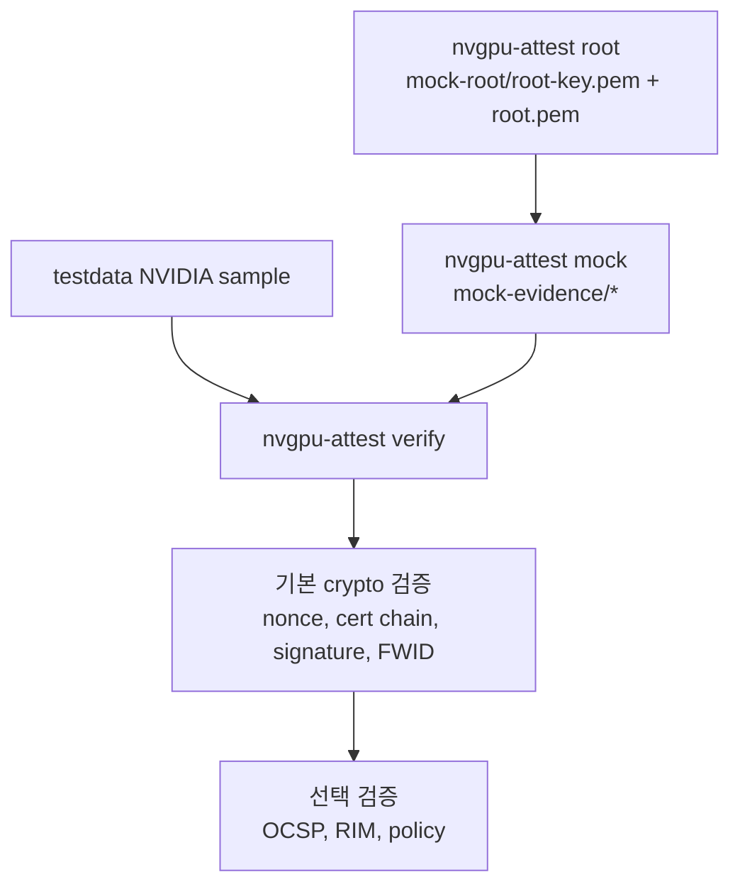

# Sample Data와 Mock Data 사용 가이드

이 문서는 현재 저장소에서 쓰는 두 종류의 입력 데이터를 정리합니다.

1. `testdata/`에 포함된 NVIDIA 샘플 데이터
2. `nvgpu-attest root` / `nvgpu-attest mock`으로 생성하는 테스트 전용 mock 데이터

두 데이터는 출처와 신뢰 anchor가 다르지만, 검증은 같은 `nvgpu-attest verify` 경로를 사용합니다.



## 1. 데이터 종류 요약

| 종류 | 위치 | 생성/출처 | 목적 | Trust anchor |
| --- | --- | --- | --- | --- |
| NVIDIA GPU split sample | `testdata/hopperAttestationReport.txt`, `testdata/hopperCertChain.txt` | NVIDIA nvtrust/local verifier 샘플 | 실제 Hopper quote 형식 검증 예제 | `testdata/device-root-bundle.pem` |
| NVIDIA GPU serialized evidence | `testdata/hopper_evidence.json`, `testdata/multi_gpu_hopper.json` | NVIDIA attestation-sdk 샘플 | SDK/JSON evidence 입력 형식 검증 | `testdata/device-root-bundle.pem` |
| NVIDIA RIM sample | `testdata/NV_GPU_*.swidtag` | NVIDIA RIM 샘플 | quote measurement를 golden measurement와 비교 | `testdata/verifier_RIM_root.pem` |
| NVIDIA NVSwitch split sample | `testdata/switchAttestationReport.txt`, `testdata/switchCertChain.txt` | NVIDIA attestation-sdk C++ unit-test 샘플 | LS10 switch attestation report 검증 예제 | `testdata/device-root-bundle.pem` |
| NVIDIA NVSwitch serialized evidence | `testdata/switch_evidence_ls10.json`, `testdata/multi_switch_ls10.json` | NVIDIA attestation-sdk 샘플 | SDK/JSON NVSwitch evidence 입력 형식 검증 | `testdata/device-root-bundle.pem` |
| NVIDIA NVSwitch BIOS RIM sample | `testdata/switchVBIOSRim_NV_SWITCH_BIOS_5612_0002_890_9610550001.xml` | NVIDIA attestation-sdk C++ unit-test 샘플 | LS10 switch runtime measurement appraisal | `testdata/verifier_RIM_root.pem` |
| RIM schema | `testdata/swidSchema2015.xsd` | SWID XML schema | `.swidtag` schema validation | 해당 없음 |
| Mock root | `mock-root/root-key.pem`, `mock-root/root.pem` | `nvgpu-attest root` | 테스트용 root key/cert 생성 | self-signed mock root |
| Mock evidence | `mock-evidence/*` | `nvgpu-attest mock` | 자체 root로 검증 가능한 모조 quote 생성 | `mock-evidence/root.pem` 또는 `mock-root/root.pem` |

> 중요: mock 데이터는 NVIDIA가 발급/서명한 데이터가 아닙니다. 테스트와 교육 목적 외에는 사용하지 마세요.

## 2. `testdata/` NVIDIA 샘플 데이터

현재 `testdata/`에는 다음 파일이 있습니다.

| 파일 | 형식 | 역할 | 주로 쓰는 옵션 |
| --- | --- | --- | --- |
| `hopperAttestationReport.txt` | hex text quote | split-file 입력의 quote 본문 | `--quote` |
| `hopperCertChain.txt` | PEM certificates | quote와 함께 제공된 device certificate chain | `--cert-chain` |
| `device-root-bundle.pem` | PEM bundle | NVIDIA device chain 검증용 root bundle | `--roots` |
| `Root-CA.pem`, `Root-CA-L1B.pem` | PEM certificate | NVIDIA device root cert 개별 파일 | 직접 디버깅/번들 구성 |
| `Root-CA.cer`, `Root-CA-L1B.cer` | DER certificate | 위 root cert의 DER 형식 | 직접 디버깅/변환 |
| `hopper_evidence.json` | JSON array | serialized evidence 단일 엔트리 | `--evidence-json` |
| `multi_gpu_hopper.json` | JSON array | serialized evidence 4개 엔트리 | `--evidence-json`, `--all-evidence` |
| `switchAttestationReport.txt` | hex text report | NVSwitch LS10 split-file 입력의 report 본문 | `nvswitch-attest verify --report` |
| `switchCertChain.txt` | PEM certificates | NVSwitch report와 함께 제공된 device certificate chain | `nvswitch-attest verify --cert-chain` |
| `switch_evidence_ls10.json` | JSON array | NVSwitch LS10 serialized evidence 단일 엔트리 | `nvswitch-attest verify --evidence-json` |
| `multi_switch_ls10.json` | JSON array | NVSwitch LS10 serialized evidence 4개 엔트리 | `nvswitch-attest verify --evidence-json --all-evidence` |
| `NV_GPU_DRIVER_GH100_550.90.07.swidtag` | SWID XML + XML DSIG | driver RIM / golden measurements | `--driver-rim` |
| `NV_GPU_VBIOS_1010_0200_882_96009F0001.swidtag` | SWID XML + XML DSIG | VBIOS RIM / golden measurements | `--vbios-rim` |
| `switchVBIOSRim_NV_SWITCH_BIOS_5612_0002_890_9610550001.xml` | SWID XML + XML DSIG | NVSwitch BIOS RIM / golden measurements | `nvswitch-attest verify --switch-bios-rim` |
| `verifier_RIM_root.pem` | PEM certificate | RIM embedded cert chain 검증 root | `--rim-root` |
| `swidSchema2015.xsd` | XML Schema | RIM `.swidtag` schema validation | `--swid-schema` |

### 2.1 Split-file sample

Split-file sample은 quote와 certificate chain이 분리되어 있습니다.

```text
testdata/hopperAttestationReport.txt  # quote 본문, hex text
testdata/hopperCertChain.txt          # PEM certificate chain
```

기본 검증:

```bash
go run ./cmd/nvgpu-attest verify \
  --quote ./testdata/hopperAttestationReport.txt \
  --cert-chain ./testdata/hopperCertChain.txt \
  --roots ./testdata/device-root-bundle.pem \
  --nonce 931d8dd0add203ac3d8b4fbde75e115278eefcdceac5b87671a748f32364dfcb
```

인자를 생략하면 위 split sample 경로와 sample nonce가 기본값으로 사용됩니다.

```bash
go run ./cmd/nvgpu-attest verify --json
```

이 검증에서 쓰는 항목:

| 검증 단계 | 사용하는 파일/값 |
| --- | --- |
| quote parsing | `hopperAttestationReport.txt` |
| nonce match | CLI `--nonce` 또는 기본 sample nonce |
| quote signature | quote + `hopperCertChain.txt`의 leaf public key |
| device cert chain | `hopperCertChain.txt` + `device-root-bundle.pem` |
| FWID match | quote opaque field 20 + leaf certificate FWID extension |

### 2.2 Serialized JSON evidence

Serialized evidence는 NVIDIA SDK 계열에서 흔히 쓰는 JSON array 형태입니다.

```json
[
  {
    "arch": "HOPPER",
    "certificate": "<base64 PEM certificate chain>",
    "evidence": "<base64 raw quote>",
    "nonce": "<64 hex chars>"
  }
]
```

현재 샘플:

| 파일 | 엔트리 수 | 용도 |
| --- | ---: | --- |
| `hopper_evidence.json` | 1 | 단일 serialized evidence 검증 |
| `multi_gpu_hopper.json` | 4 | multi-GPU evidence 중 특정 index 또는 전체 검증 |

단일 파일 검증:

```bash
go run ./cmd/nvgpu-attest verify \
  --evidence-json ./testdata/hopper_evidence.json \
  --roots ./testdata/device-root-bundle.pem \
  --json
```

multi-GPU 특정 index 검증:

```bash
go run ./cmd/nvgpu-attest verify \
  --evidence-json ./testdata/multi_gpu_hopper.json \
  --evidence-index 2 \
  --roots ./testdata/device-root-bundle.pem
```

multi-GPU 전체 검증:

```bash
go run ./cmd/nvgpu-attest verify \
  --evidence-json ./testdata/multi_gpu_hopper.json \
  --all-evidence \
  --roots ./testdata/device-root-bundle.pem \
  --json
```

serialized evidence에서는 JSON 안의 `nonce`가 기본 expected nonce로 사용됩니다. `--nonce`를 지정하면 CLI 값이 우선합니다.

### 2.3 RIM sample과 measurement 검증

RIM은 runtime measurement를 평가하기 위한 signed golden measurement 문서입니다.

| RIM 파일 | RIM ID | quote에서 매칭되는 값 |
| --- | --- | --- |
| `NV_GPU_DRIVER_GH100_550.90.07.swidtag` | `NV_GPU_DRIVER_GH100_550.90.07` | driver version `550.90.07` |
| `NV_GPU_VBIOS_1010_0200_882_96009F0001.swidtag` | `NV_GPU_VBIOS_1010_0200_882_96009F0001` | VBIOS version `96.00.9F.00.01` + project/SKU/chip fields |

전체 검증 예:

```bash
go run ./cmd/nvgpu-attest verify \
  --verify-ocsp \
  --verify-rim \
  --driver-rim ./testdata/NV_GPU_DRIVER_GH100_550.90.07.swidtag \
  --vbios-rim ./testdata/NV_GPU_VBIOS_1010_0200_882_96009F0001.swidtag \
  --rim-root ./testdata/verifier_RIM_root.pem \
  --swid-schema ./testdata/swidSchema2015.xsd \
  --time 2026-05-25T00:00:00Z
```

`--verify-rim`이 수행하는 일:

1. quote opaque fields에서 driver/VBIOS/RIM ID 구성 값을 추출합니다.
2. `--driver-rim`, `--vbios-rim` 파일을 읽거나, 경로가 없으면 RIM service에서 fetch합니다.
3. `swidSchema2015.xsd`로 XML schema validation을 수행합니다.
4. RIM 내부 certificate chain을 `verifier_RIM_root.pem`으로 검증합니다.
5. RIM certificate OCSP를 확인합니다.
6. XML Signature(ECDSA-SHA384)를 검증합니다.
7. active golden measurements와 quote runtime measurements를 비교합니다.

> 현재 샘플 driver RIM certificate는 `2026-06-01T02:08:29Z` 이후 현재 시간 기준으로 만료됩니다. 재현 목적이면 위 예시처럼 `--time 2026-05-25T00:00:00Z`를 지정하세요. 운영 검증에는 최신 RIM을 사용해야 합니다.

### 2.4 NVSwitch LS10 sample

NVSwitch sample은 별도 CLI인 `nvswitch-attest`로 검증합니다.

기본 split-file 검증:

```bash
go run ./cmd/nvswitch-attest verify \
  --report ./testdata/switchAttestationReport.txt \
  --cert-chain ./testdata/switchCertChain.txt \
  --roots ./testdata/device-root-bundle.pem \
  --nonce 931d8dd0add203ac3d8b4fbde75e115278eefcdceac5b87671a748f32364dfcb \
  --json
```

serialized JSON 검증:

```bash
go run ./cmd/nvswitch-attest verify \
  --evidence-json ./testdata/switch_evidence_ls10.json \
  --roots ./testdata/device-root-bundle.pem \
  --json
```

multi-switch JSON 전체 검증:

```bash
go run ./cmd/nvswitch-attest verify \
  --evidence-json ./testdata/multi_switch_ls10.json \
  --all-evidence \
  --roots ./testdata/device-root-bundle.pem \
  --json
```

NVSwitch BIOS RIM + measurement 검증:

```bash
go run ./cmd/nvswitch-attest verify \
  --verify-rim \
  --switch-bios-rim ./testdata/switchVBIOSRim_NV_SWITCH_BIOS_5612_0002_890_9610550001.xml \
  --rim-root ./testdata/verifier_RIM_root.pem \
  --swid-schema ./testdata/swidSchema2015.xsd \
  --time 2026-05-20T00:00:00Z \
  --skip-rim-ocsp \
  --json
```

주의:

- NVIDIA attestation-sdk의 switch sample RIM은 unit-test/staging 성격의 artifact라 현재 날짜 기준 certificate validity 또는 public OCSP freshness 검증에 실패할 수 있습니다.
- `--skip-rim-ocsp`는 이 샘플 재현을 위한 옵션입니다. 운영 검증에서는 RIM cert chain, RIM XML signature, measurement 비교뿐 아니라 RIM certificate OCSP/freshness 정책도 유지해야 합니다.
- 현재 구현은 LS10 RIM ID 규칙(`NV_SWITCH_BIOS_5612_0002_890_<BIOS version>`)을 지원합니다.

## 3. Mock 데이터

Mock 데이터는 실제 NVIDIA evidence가 아니라, verifier 개발/테스트를 위해 같은 quote parser와 verifier 경로를 통과하도록 만든 모조 데이터입니다.

### 3.1 Mock root 생성물

생성:

```bash
go run ./cmd/nvgpu-attest root --out ./mock-root
```

생성 파일:

| 파일 | 형식 | 설명 | 검증에서 사용 |
| --- | --- | --- | --- |
| `mock-root/root-key.pem` | PEM EC private key, P-384 | mock leaf certificate를 서명할 테스트용 root private key | `mock --root-key` |
| `mock-root/root.pem` | PEM self-signed X.509 cert | mock root trust anchor | `mock --root-cert`, `verify --roots` |

특징:

- root certificate subject는 `CN=NVGPU Mock Test Root CA,O=nvgpu-attestation test-only`입니다.
- NVIDIA root가 아니며, NVIDIA device/RIM trust chain과 관련 없습니다.
- `root-key.pem`은 private key이므로 저장소에 커밋하면 안 됩니다.

### 3.2 Mock evidence 생성물

생성:

```bash
go run ./cmd/nvgpu-attest mock \
  --root-key ./mock-root/root-key.pem \
  --root-cert ./mock-root/root.pem \
  --out ./mock-evidence
```

생성 파일:

| 파일 | 형식 | 설명 | 검증에서 사용 |
| --- | --- | --- | --- |
| `mock-evidence/nonce.txt` | text, 64 hex chars + newline | quote request nonce | `verify --nonce $(cat ...)` |
| `mock-evidence/quote.hex` | hex text | mock NVGPU-like quote | `verify --quote` |
| `mock-evidence/cert-chain.pem` | PEM certificates | mock leaf cert + mock root cert | `verify --cert-chain` |
| `mock-evidence/root.pem` | PEM certificate | 검증 편의를 위해 복사된 mock root cert | `verify --roots` |
| `mock-evidence/leaf-key.pem` | PEM EC private key, P-384 | mock quote 서명용 leaf private key | 검증에는 필요 없음 |
| `mock-evidence/evidence.json` | JSON array | serialized evidence 형식의 mock quote + cert chain | `verify --evidence-json` |

기본 mock 값:

| 항목 | 기본값 |
| --- | --- |
| nonce | `00112233445566778899aabbccddeeff00112233445566778899aabbccddeeff` |
| driver version | `999.0.mock` |
| VBIOS version | `96.00.9f.00.01` |
| measurement count | `64` |
| certificate validity | `365`일 |

### 3.3 Mock quote 형식

mock quote는 실제 NVIDIA가 서명한 quote가 아니지만, 이 저장소의 parser가 기대하는 구조를 따릅니다.

```text
quote = request(37 bytes) || response(variable length)
response = response_header(8 bytes)
         || measurement_record
         || response_nonce(32 bytes)
         || opaque_fields
         || signature(96 bytes)
```

mock quote의 암호학적 구조:

| 항목 | 값 |
| --- | --- |
| quote signature | ECDSA P-384, SHA-384, raw `r || s` 96 bytes |
| signing key | `mock-evidence/leaf-key.pem` |
| signature verification key | `cert-chain.pem`의 leaf certificate public key |
| certificate chain | leaf cert → mock root cert |
| trust anchor | `mock-evidence/root.pem` 또는 `mock-root/root.pem` |
| FWID | random 48 bytes, quote opaque field와 leaf cert extension에 동일하게 삽입 |

mock quote opaque fields에는 다음 값이 들어갑니다.

| Field | 값 |
| --- | --- |
| driver version | `--driver-version` 값 |
| VBIOS version | `--vbios-version` 값 |
| NVDEC0 status | disabled |
| chip info | `MOCK GPU - NOT NVIDIA` |
| feature flag | `SPT` |
| FWID | 생성 시 random 48 bytes |

### 3.4 Mock split-file 검증

```bash
go run ./cmd/nvgpu-attest verify \
  --quote ./mock-evidence/quote.hex \
  --cert-chain ./mock-evidence/cert-chain.pem \
  --roots ./mock-evidence/root.pem \
  --nonce $(cat ./mock-evidence/nonce.txt) \
  --policy-driver-version 999.0.mock \
  --policy-vbios-version 96.00.9f.00.01 \
  --json
```

이 검증에서 쓰는 항목:

| 검증 단계 | 사용하는 파일/값 |
| --- | --- |
| quote parsing | `mock-evidence/quote.hex` |
| nonce match | `mock-evidence/nonce.txt` |
| quote signature | quote + mock leaf certificate public key |
| cert chain | `mock-evidence/cert-chain.pem` + `mock-evidence/root.pem` |
| FWID match | mock quote opaque FWID + mock leaf cert FWID extension |
| optional policy | `--policy-driver-version`, `--policy-vbios-version` |

### 3.5 Mock serialized evidence 검증

```bash
go run ./cmd/nvgpu-attest verify \
  --evidence-json ./mock-evidence/evidence.json \
  --roots ./mock-evidence/root.pem \
  --policy-arch MOCK \
  --json
```

`mock-evidence/evidence.json`도 NVIDIA SDK serialized evidence와 같은 shape를 사용합니다.

```json
[
  {
    "arch": "MOCK",
    "certificate": "<base64 PEM certificate chain>",
    "evidence": "<base64 raw quote>",
    "nonce": "<64 hex chars>"
  }
]
```

## 4. Sample과 Mock의 검증 차이

| 항목 | NVIDIA sample | Mock data |
| --- | --- | --- |
| quote 출처 | NVIDIA sample evidence | local generator |
| quote parser | 동일 | 동일 |
| quote signature 알고리즘 | ECDSA P-384 / SHA-384 / raw `r || s` | ECDSA P-384 / SHA-384 / raw `r || s` |
| certificate chain | NVIDIA device chain | mock leaf → mock root |
| trust anchor | `device-root-bundle.pem` | `mock-evidence/root.pem` 또는 `mock-root/root.pem` |
| FWID match | quote FWID ↔ NVIDIA leaf cert FWID | quote FWID ↔ mock leaf cert FWID |
| RIM/measurement | NVIDIA RIM으로 가능 | 기본 mock RIM 없음 |
| OCSP | NVIDIA endpoint로 가능 | mock root에는 OCSP endpoint 없음 |
| 운영 신뢰성 | 샘플/실제 evidence 검증 연구용 | 테스트 전용, 운영 불가 |

## 5. 어떤 데이터를 언제 쓰나?

| 목적 | 권장 데이터 | 명령 |
| --- | --- | --- |
| verifier 기본 동작 확인 | split-file sample | `nvgpu-attest verify --json` |
| SDK JSON 입력 처리 확인 | `hopper_evidence.json` | `nvgpu-attest verify --evidence-json ...` |
| multi-GPU batch 처리 확인 | `multi_gpu_hopper.json` | `nvgpu-attest verify --all-evidence ...` |
| RIM/OCSP/measurement 흐름 확인 | split sample + RIM sample | `nvgpu-attest verify --verify-ocsp --verify-rim ... --time ...` |
| test-only quote 생성/파싱/서명 검증 | mock root + mock evidence | `nvgpu-attest root`, `nvgpu-attest mock`, `nvgpu-attest verify ...` |
| policy 옵션 실험 | mock evidence | `--policy-driver-version`, `--policy-arch` |

## 6. 보안 주의사항

- `mock-root/root-key.pem`과 `mock-evidence/leaf-key.pem`은 private key입니다.
- `mock-root/`와 `mock-evidence/`는 `.gitignore`에 포함되어 있습니다.
- mock root를 NVIDIA root bundle과 섞지 마세요.
- mock evidence를 실제 attestation 성공으로 처리하지 마세요.
- 운영 검증에서는 최신 NVIDIA root/RIM/OCSP 정책과 service-specific policy를 사용하세요.
